# Build a Node.js and React app with npm 

#### Go thorugh [Jenkins installation](./install-jenkins.md) if you are running this tutorial for first time.

### Fork and clone the sample repository on GitHub

Obtain the simple "Welcome to React" Node.js and React application from GitHub, by forking the sample repository of the application’s source code into your own GitHub account and then cloning this fork locally.

1. Ensure you are signed in to your GitHub account. If you don’t yet have a GitHub account, sign up for a free one on the [GitHub website](https://github.com/).

2. Fork the [simple-node-js-react-npm-app](https://github.com/GeorgeBrownCollege-Toronto/simple-node-js-react-npm-app.git) on GitHub into your local GitHub account. If you need help with this process, refer to the [Fork A Repo](https://help.github.com/articles/fork-a-repo/) documentation on the GitHub website for more information.

3. Clone your forked `simple-node-js-react-npm-app` repository (on GitHub) locally to your machine. To begin this process, do either of the following (where `<your-username>` is the name of your user account on your operating system):

- If you have the GitHub Desktop app installed on your machine:

    * In GitHub, click the green **Clone or download** button on your forked repository, then **Open in Desktop**.

    * In GitHub Desktop, before clicking **Clone** on the **Clone a Repository** dialog box, ensure **Local Path** for:

        * macOS is `/Users/<your-username>/Documents/GitHub/simple-node-js-react-npm-app`

        * Linux is `/home/<your-username>/GitHub/simple-node-js-react-npm-app`

        * Windows is `C:\Users\<your-username>\Documents\GitHub\simple-node-js-react-npm-app`

- Otherwise:

    - Open up a terminal/command line prompt and `cd` to the appropriate directory on:

        - macOS - `/Users/<your-username>/Documents/GitHub/`

        - Linux - `/home/<your-username>/GitHub/`

        - Windows - `C:\Users\<your-username>\Documents\GitHub\` (although use a Git bash command line window as opposed to the usual Microsoft command prompt)

    - Run the following command to continue/complete cloning your forked repo:
`git clone https://github.com/YOUR-GITHUB-ACCOUNT-NAME/simple-node-js-react-npm-app`
where `YOUR-GITHUB-ACCOUNT-NAME` is the name of your GitHub account.

### Create your Pipeline project in Jenkins

1. Go back to Jenkins, log in again if necessary and click **create new jobs** under **Welcome to Jenkins!**
**Note:** If you don’t see this, click **New Item** at the top left.

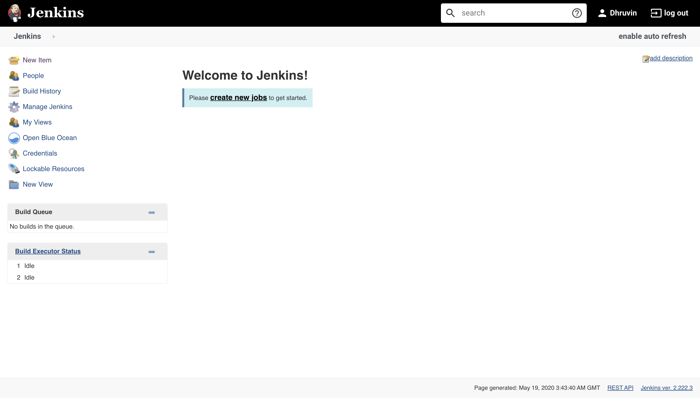

2. In the **Enter an item name** field, specify the name for your new Pipeline project (e.g. `simple-node-js-react-npm-app`).

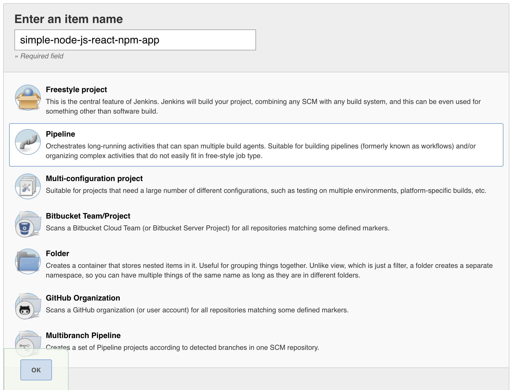

3. Scroll down and click **Pipeline**, then click **OK** at the end of the page.

4. ( *Optional* ) On the next page, specify a brief description for your Pipeline in the **Description** field (e.g. `An entry-level Pipeline demonstrating how to use Jenkins to build a simple Node.js and React application with npm`.)

5. Click the **Pipeline** tab at the top of the page to scroll down to the **Pipeline** section.

6. From the **Definition** field, choose the **Pipeline script from SCM** option. This option instructs Jenkins to obtain your Pipeline from Source Control Management (SCM), which will be your locally cloned Git repository.

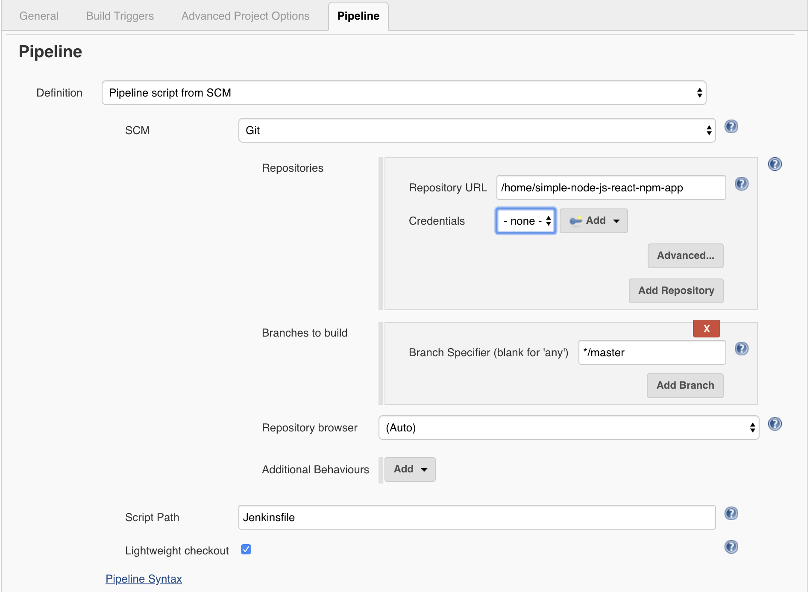

7. From the **SCM** field, choose **Git**.

8. In the **Repository URL** field, specify the directory path of your locally cloned repository [above](#fork-sample-repository), which is from your user account/home directory on your host machine, mapped to the `/home` directory of the Jenkins container - i.e.

    - For macOS - `/home/Documents/GitHub/simple-node-js-react-npm-app`

    - For Linux - `/home/GitHub/simple-node-js-react-npm-app`

    - For Windows - `/home/Documents/GitHub/simple-node-js-react-npm-app`

Click **Save** to save your new Pipeline project. You’re now ready to begin creating your `Jenkinsfile`, which you’ll be checking into your locally cloned Git repository.

### Create your initial Pipeline as a Jenkinsfile

You’re now ready to create your Pipeline that will automate building your Node.js and React application in Jenkins. Your Pipeline will be created as a `Jenkinsfile`, which will be committed to your locally cloned Git repository (`simple-node-js-react-npm-app`).

This is the foundation of "Pipeline-as-Code", which treats the continuous delivery pipeline as a part of the application to be versioned and reviewed like any other code. Read more about Pipeline and what a Jenkinsfile is in the [Pipeline](https://www.jenkins.io/doc/book/pipeline) and [Using a Jenkinsfile](https://www.jenkins.io/doc/book/pipeline/jenkinsfile) sections of the User Handbook.

First, create an initial Pipeline to download a Node Docker image and run it as a Docker container (which will build your simple Node.js and React application). Also add a "Build" stage to the Pipeline that begins orchestrating this whole process.

1. Using your favorite text editor or IDE, create and save new text file with the name `Jenkinsfile` at the root of your local `simple-node-js-react-npm-app` Git repository.

2. Copy the following Declarative Pipeline code and paste it into your empty `Jenkinsfile`:

```groovy
pipeline {
    agent {
        docker {
            image 'node:latest' 
            args '-p 3000:3000'
        }
    }
    stages {
        stage('Build') { 
            steps {
                sh 'npm install' 
            }
        }
    }
}
```

- `image 'node:latest` **image** parameter (of the [agent](https://www.jenkins.io/doc/book/pipeline/syntax#agent) section’s `docker` parameter) downloads the [`node:latest Docker image`](https://hub.docker.com/_/node/) (if it’s not already available on your machine) and runs this image as a separate container. This means that:
    - You’ll have separate Jenkins and Node containers running locally in Docker.

    - The Node container becomes the [agent](https://www.jenkins.io/doc/book/glossary/#agent) that Jenkins uses to run your Pipeline project. However, this container is short-lived - its lifespan is only that of the duration of your Pipeline’s execution.

- `stage(Build')` Defines a [stage](https://www.jenkins.io/doc/book/pipeline/syntax/#stage) (directive) called `Build` that appears on the Jenkins UI.

- `sh 'npm install' ` `sh` step (of the [steps](https://www.jenkins.io/doc/book/pipeline/syntax/#steps) section) executes the `npm` command to ensure that all dependencies required to run your application have been downloaded to the `node_modules` workspace directory (within the `/var/jenkins_home/workspace/simple-node-js-react-npm-app` directory in the Jenkins container).


3. Save your edited `Jenkinsfile` and commit it to your local `simple-node-js-react-npm-app` Git repository. E.g. Within the `simple-node-js-react-npm-app` directory, run the commands:
`git add .`
then
`git commit -m "Add initial Jenkinsfile"`

4. Go back to Jenkins again, log in again if necessary and click **Open Blue Ocean** on the left to access Jenkins’s Blue Ocean interface.

5. In the **This job has not been run message box**, click **Run**, then quickly click the **OPEN** link which appears briefly at the lower-right to see Jenkins building your Pipeline project. If you weren’t able to click the **OPEN** link, click the row on the main Blue Ocean interface to access this feature.

**Note:** You may need to wait several minutes for this first run to complete. After making a clone of your local `simple-node-js-react-npm-app` Git repository itself, Jenkins:

- Initially queues the project to be run on the agent.

- Downloads the Node Docker image and runs it in a container on Docker.

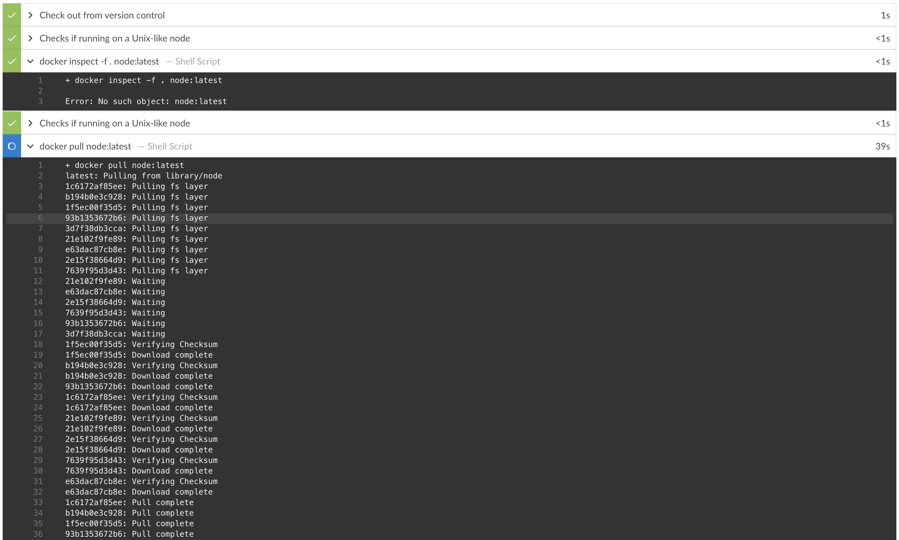

- Runs the `Build` stage (defined in the `Jenkinsfile`) on the Node container. During this time, `npm` downloads many dependencies necessary to run your Node.js and React application, which will ultimately be stored in the `node_modules` workspace directory (within the Jenkins home directory).

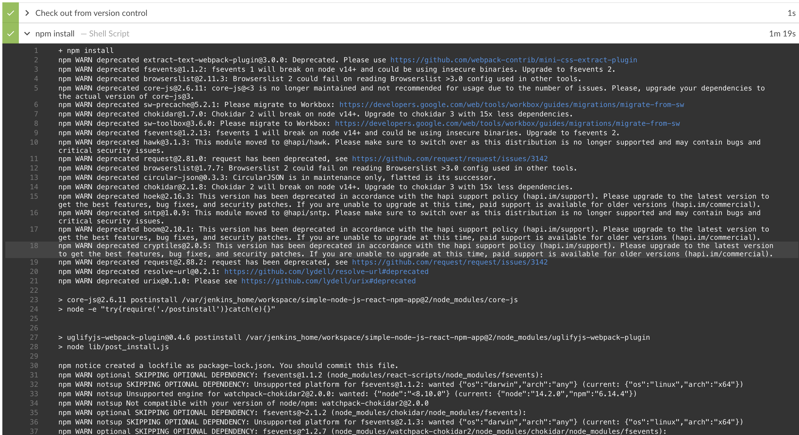

The Blue Ocean interface turns green if Jenkins built your Node.js and React application successfully.

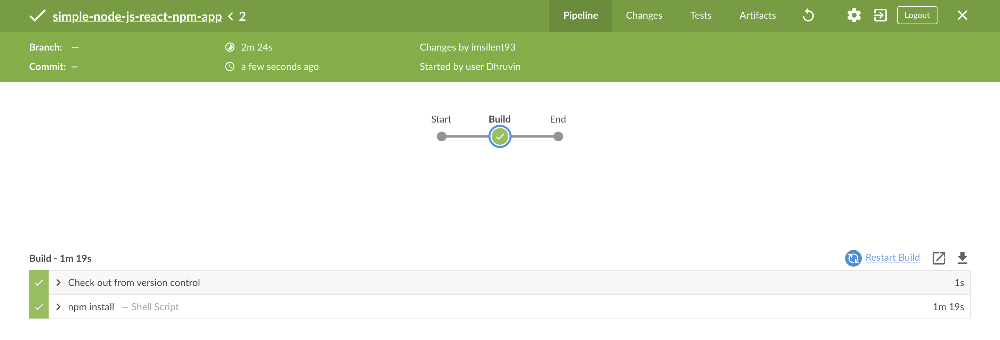

6. Click the **X** at the top-right to return to the main Blue Ocean interface.

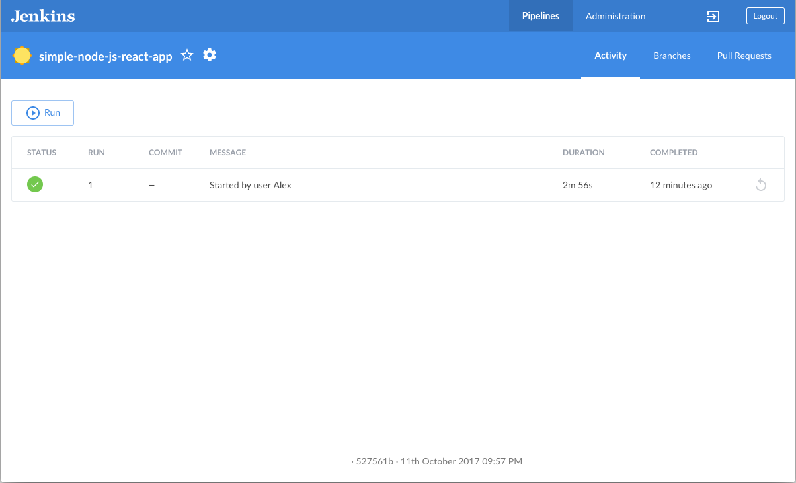

### Add a test stage to your Pipeline
Go back to your text editor/IDE and ensure your `Jenkinsfile` is open.

Copy and paste the following Declarative Pipeline syntax immediately under the `agent` section of your `Jenkinsfile`:

```groovy
    environment {
        CI = 'true'
    }
```

as well as the following immediately under the `Build` stage:

```groovy
        stage('Test') {
            steps {
                sh 'chmod +x ./jenkins/scripts/test.sh'
                sh './jenkins/scripts/test.sh'
            }
        }
```
so that you end up with:

```groovy
pipeline {
    agent {
        docker {
            image 'node:latest'
            args '-p 3000:3000'
        }
    }
    environment {
        CI = 'true' 
    }
    stages {
        stage('Build') {
            steps {
                sh 'npm install'
            }
        }
        stage('Test') { 
            steps {
                sh 'chmod +x ./jenkins/scripts/test.sh'
                sh './jenkins/scripts/test.sh' 
            }
        }
    }
}
```
The [environment](https://www.jenkins.io/doc/book/pipeline/syntax#environment) directive sets the environment variable `CI` with a boolean value of `true`, which is available to all steps in this Pipeline. When the `npm test` command in `test.sh` (which is run during the Test stage defined further down the Pipeline) detects the environment variable `CI` with a value of `true`, then this command is run in "non-watch" (i.e. non-interactive) mode. In "watch" mode, `npm test` expects user input, which can pause running builds of CI/CD applications indefinitely. As an alternative to specifying the `environment` directive in a Jenkins Pipeline, you could also specify this environment variable in the `package.json` file (to pass on to the `npm test` command) by:

- Uncommenting the `npm install --save-dev cross-env` command in `jenkins/scripts/test.sh` (to install the `cross-env` dependency during the `Test stage`). Read more about this in the test.sh file itself.

- Updating the following line in the package.json file (at the root of the simple-node-js-react-npm-app repository) from:

* "test": "react-scripts test --env=jsdom",
to

* "test": "cross-env CI=true react-scripts test --env=jsdom",

- Defines a [stage](https://www.jenkins.io/doc/book/pipeline/syntax/#stage) (directive) called `Test` that appears on the Jenkins UI.

- This [`sh`](https://www.jenkins.io/doc/pipeline/steps/workflow-durable-task-step/#code-sh-code-shell-script) step (of the [steps](https://www.jenkins.io/doc/book/pipeline/syntax/#steps) section) runs the shell script `test.sh` located in the jenkins/scripts directory from the root of the simple-node-js-react-npm-app repository. Explanations about what this script does are covered in the test.sh file itself. As a general principle, it’s a good idea to keep your Pipeline code (i.e. the `Jenkinsfile`) as tidy as possible and place more complex build scripting steps into separate shell script files like the test.sh file. This ultimately facilitates the maintenance of your Pipeline, especially if it gains more complexity.

3. Save your edited `Jenkinsfile` and commit it to your local `simple-node-js-react-npm-app` Git repository. E.g. Within the `simple-node-js-react-npm-app` directory, run the commands:
`git stage .`
then
`git commit -m "Add 'Test' stage"`

4. Go back to Jenkins again, log in again if necessary and ensure you’ve accessed Jenkins’s Blue Ocean interface.

5. Click Run at the top left, then quickly click the **OPEN** link which appears briefly at the lower-right to see Jenkins running your amended Pipeline project. If you weren’t able to click the **OPEN** link, click the top row on the Blue Ocean interface to access this feature.
**Note:** You’ll notice from this run that Jenkins no longer needs to download the Node Docker image. Instead, Jenkins only needs to run a new container from the Node image downloaded previously. Also, from now on, no (new) `npm` dependencies should need to be downloaded during the "Build" stage. Therefore, running your Pipeline this subsequent time should be much faster.
If your amended Pipeline ran successfully, here’s what the Blue Ocean interface should look like. Notice the additional "Test" stage. You can click on the previous "Build" stage circle to access the output from that stage.

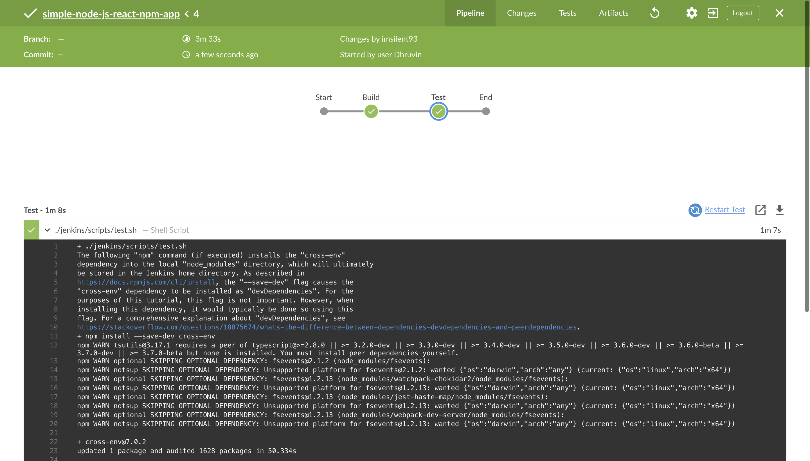

6. Click the **X** at the top-right to return to the main Blue Ocean interface.

### Add a final deliver stage to your Pipeline

1. Go back to your text editor/IDE and ensure your `Jenkinsfile` is open.

2. Copy and paste the following Declarative Pipeline syntax immediately under the `Test` stage of your `Jenkinsfile`:

```groovy
        stage('Deliver') {
            steps {
                sh 'chmod +x ./jenkins/scripts/deliver.sh'
                sh './jenkins/scripts/deliver.sh'
                input message: 'Finished using the web site? (Click "Proceed" to continue)'
                sh 'chmod +x ./jenkins/scripts/kill.sh'
                sh './jenkins/scripts/kill.sh'
            }
        }
```
so that you end up with:

```groovy
pipeline {
    agent {
        docker {
            image 'node:latest'
            args '-p 3000:3000'
        }
    }
    environment { 
        CI = 'true'
    }
    stages {
        stage('Build') {
            steps {
                sh 'npm install'
            }
        }
        stage('Test') {
            steps {
                sh 'chmod +x ./jenkins/scripts/test.sh'
                sh './jenkins/scripts/test.sh'
            }
        }
        stage('Deliver') { 
            steps {
                sh 'chmod +x ./jenkins/scripts/deliver.sh'
                sh './jenkins/scripts/deliver.sh' 
                input message: 'Finished using the web site? (Click "Proceed" to continue)' 
                sh 'chmod +x ./jenkins/scripts/kill.sh'
                sh './jenkins/scripts/kill.sh' 
            }
        }
    }
}
```

- [`environment`](https://www.jenkins.io/doc/book/pipeline/syntax#environment) directive might not be present in your Pipeline if you chose to specify the `CI` environment variable in the `package.json` file [above](#add-a-test-stage-to-your-pipeline).

- `stage('Deliver')` Defines a new stage called `Deliver` that appears on the Jenkins UI.

- `sh './jenkins/scripts/deliver.sh'` [sh](https://www.jenkins.io/doc/pipeline/steps/workflow-durable-task-step/#code-sh-code-shell-script) step (of the steps section) runs the shell script deliver.sh located in the jenkins/scripts directory from the root of the simple-node-js-react-npm-app repository. Explanations about what this script does are covered in the deliver.sh file itself.

- `input message: 'Finished using the web site? (Click "Proceed" to continue)'` [input](https://www.jenkins.io/doc/pipeline/steps/pipeline-input-step/#code-input-code-wait-for-interactive-input) step (provided by the [Pipeline: Input Step](https://www.jenkins.io/doc/pipeline/steps/pipeline-input-step) plugin) pauses the running build and prompts the user (with a custom message) to proceed or abort.

- `sh './jenkins/scripts/kill.sh'` This [sh](https://www.jenkins.io/doc/pipeline/steps/workflow-durable-task-step/#code-sh-code-shell-script) step runs the shell script `kill.sh`, also located in the `jenkins/scripts` directory. Explanations about what this script does are covered in the `kill.sh` file itself.

3. Save your edited `Jenkinsfile` and commit it to your local `simple-node-js-react-npm-app` Git repository. E.g. Within the `simple-node-js-react-npm-app` directory, run the commands:
`git stage .`
then
`git commit -m "Add 'Deliver' stage"`

4. Go back to Jenkins again, log in again if necessary and ensure you’ve accessed Jenkins’s Blue Ocean interface.

5. Click **Run** at the top left, then quickly click the **OPEN** link which appears briefly at the lower-right to see Jenkins running your amended Pipeline project. If you weren’t able to click the **OPEN** link, click the top row on the Blue Ocean interface to access this feature.
If your amended Pipeline ran successfully, here’s what the Blue Ocean interface should look like. Notice the additional "Deliver" stage. Click on the previous "Test" and "Build" stage circles to access the outputs from those stages.

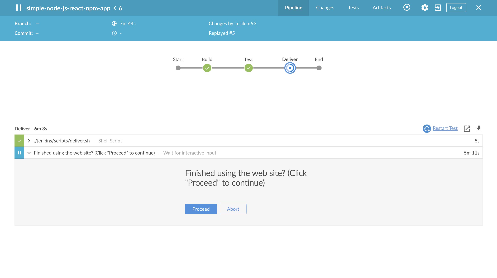

6. Ensure you are viewing the "Deliver" stage (click it if necessary), then click the green `./jenkins/scripts/deliver.sh` step to expand its content and scroll down until you see the `http://localhost:3000` link.

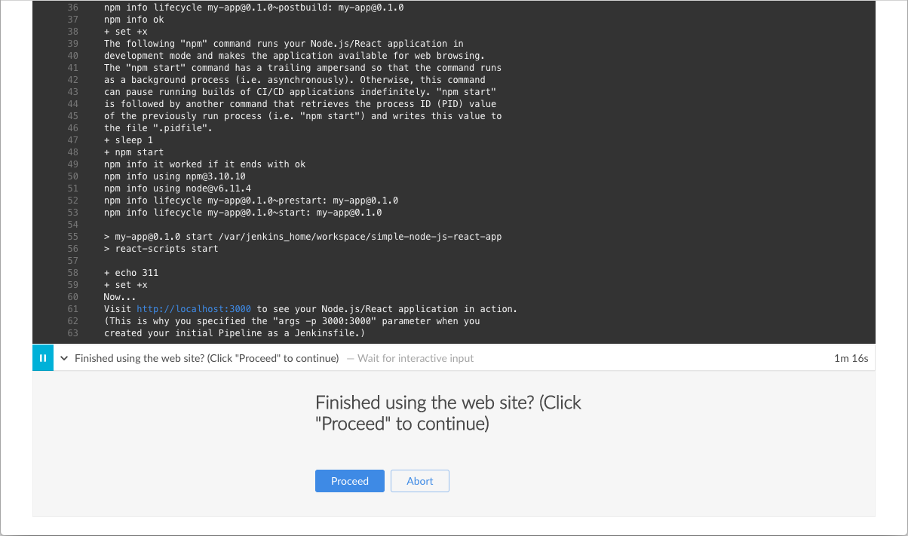

7. Click the `http://localhost:3000` link to view your Node.js and React application running (in development mode) in a new web browser tab. You should see a page/site with the title **Welcome to React** on it.
Tip: If you’re feeling a little adventurous, you can try accessing the terminal/command prompt of your Jenkins Docker container, then using vi editor, tweak and save the `App.js` source file and see the results appear on the **Welcome to React page**. To do this, run the following commands:

```bash
docker exec -it <docker-container-name> bash 
cd /var/jenkins_home/workspace/simple-node-js-react-npm-app/src 
vi App.js 
```

- `docker exec -it <docker-container-name> bash ` command provides access to the terminal/command prompt of your Jenkins Docker container. The `<docker-container-name>` can be obtained using the command `docker ps`. Otherwise, it would be `jenkins-tutorials` (if you specified this in the command you used to run this container [above](#run-jenkins-in-docker) - i.e. `--name jenkins-tutorials`).

- Once in the container, change directory to the Node.js and React source directory (in the Jenkins workspace directory within Jenkins home).

- Access, edit and save changes to your application’s `App.js` file using vi editor.

8. When you are finished viewing the page/site, click the **Proceed** button to complete the Pipeline’s execution.

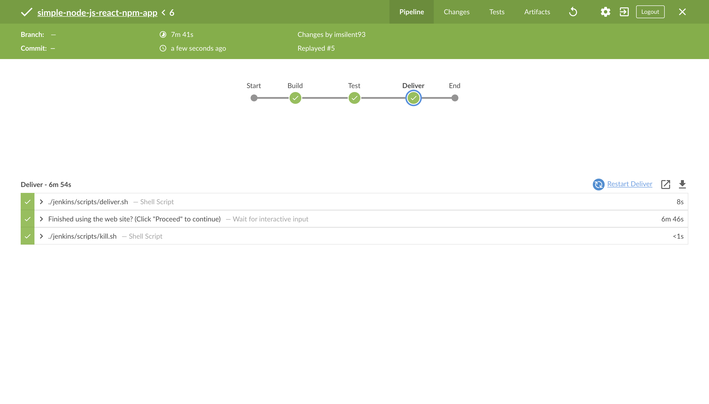

9. Click the **X** at the top-right to return to the main Blue Ocean interface, which lists your previous Pipeline runs in reverse chronological order.

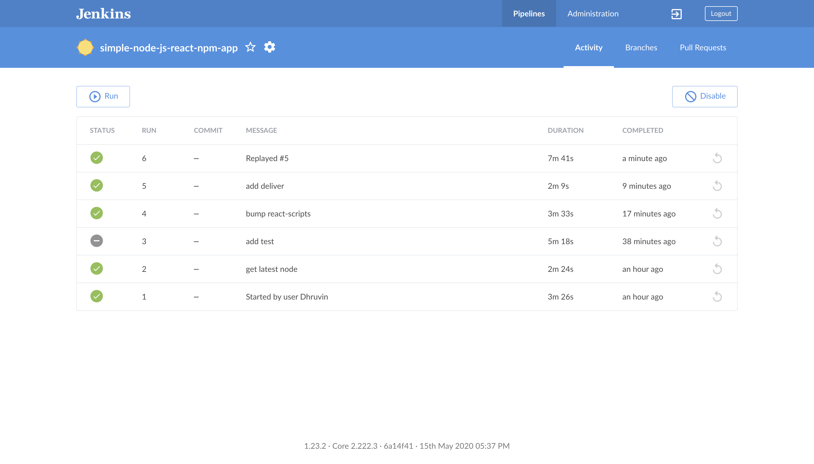

#### Credits

[Jenkins tutorial overview](https://www.jenkins.io/doc/tutorials/)