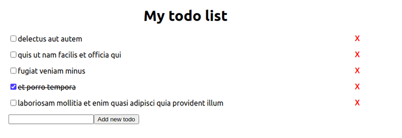
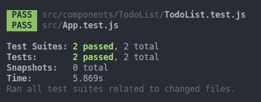
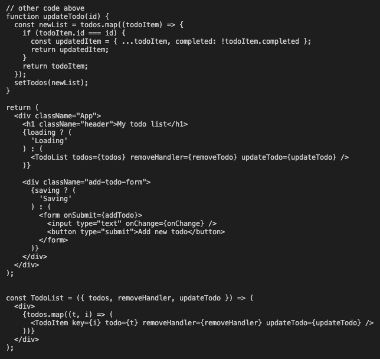

# Front-end web development the TDD way

In this lab, you'll learn how to test React apps with `react-testing-library` by following a Test Driven Development (TDD) approach.You'll build Todo app where user should be able to add, remove, and check off a todo item. This is how are final app will look like.



## Importance of Test driven development

- When you add a feature or refactor code, you don't break anything that has already been working. 
- Manually testing everything again when you add or remove code is not efficient. 
- Regression is annoying. (It means a feature was working before and after adding a new feature, the previous feature is no longer working). 
- Automated tests save lots of developers time.
- Better code quality, higher test coverage, and better software.

## Pre-requisites

I hope you already know :
- React, React hooks (`useEffect` and `useState`)
- HTML
- CSS
- ES6 features and syntax

## What is TDD?

- An approach in software development where tests are written first before writing the actual code. 

### Steps involved in TDD 
1. Write a code that fails. This ensures that you avoid false positives. (RED)
2. Write the minimum code to make the test pass. (GREEN)
3. Refactor to improve the existing implementation. (REFACTOR)

## [`react-testing-library`](https://testing-library.com/docs/react-testing-library/intro/)

- It is a wrapper of [DOM Testing Library](https://testing-library.com/docs/dom-testing-library/intro/) for testing React components. The DOM Testing Library is a simple, lightweight, open source, library that provides API for querying and interacting with DOM nodes. Besides React, the DOM Testing Library has also been used to create other wrappers for other frameworks, like Angular, Vue, and Svelte.

- It prevents from implementation details testing. The implementation details are things that users would not normally see or use. It is only known to the developers (ex. the state of your app).

- You can [read more](https://kentcdodds.com/blog/testing-implementation-details) about the problems with testing implementation details.

## Setup

- Create a new React app with `create-react-app`.

    ```bash
    create-react-app demo-tdd
    cd demo-tdd
    yarn start
    ```
- Run following command to install React testing libraries

    ```bash
    npm i --save-dev @testing-library/jest-dom @testing-library/react @testing-library/user-event
    ```
- It install following libraries
  - **@testing-library/jest-dom**. Make assertions about the state of the DOM using custom jest matchers for the DOM.
  - **@testing-library/react**. APIs to work with React components in our tests.
  - **@testing-library/user-event**. API to simulate real events(such as click) in the browser as the user interacts with the DOM. The @testing-library/react library already provides a `fireEvent` function to simulate events, but @testing-library/user-event provides a more advanced simulation.

  >If you are getting **"MutationObserver is not a constructor"** error, >install `jest-environment-jsdom-sixteen`. To install, Run 
  >```bash
  >npm i --save-dev jest-environment-jsdom-sixteen
  >````

- Inside the package.json, change the test script tag to this.
    ```json
    "scripts": {
    ...
    "test": "react-scripts test --env=jest-environment-jsdom-sixteen",
    ...
    }
    ```
- Run test
    ```bash
    yarn test
    ```
### Displaying items in todo list

#### Failing test
- Create a todo list component that renders the list of todo items. Inside `src/components/TodoList`, create a TodoList component together with its test file.


- The TodoList component accepts a list of todos. You'll write the test before implementing the component, so simply return an empty `div`.


- Here testing of TodoList component showing the title of todo items will be done. 
- The **@testing-library/react** library provides functions and objects like render and screen to interact with React components. 
- The render function is used to render a React component; TodoList component here. 
- Pass fake list of todos as it needs a list of todos.
- Here is a what the mockData contains inside `src/mockData.js`.


- You should be able to actually see items on the screen.
- Query the DOM elements to know what is on the screen. 
- React testing library provides a screen object that provides different methods for querying elements in the DOM. 
- You can get elements by their text, role, label, testId, and other ways. 
- So in this piece of code,


- Iterate through each todo list item and expect the title to be in the document (or page). 
- `screen.getByText()` is used to get the element that has the title of todo. 
- validate that the title indeed exists in the document using Jest's expect function and custom matchers.

#### Making the test pass

- `yarn test` will gives an error because component are not implemented yet, todo items are not displayed as well.


- Now you'll implement the TodoList component to make the test pass.


- Now test passes.


#### Render TodoList component in App component

- Get the data from a **JSONPlaceholder** - a nice fake REST API that we can play around with.
- Modify `App.js` and `App.test.js` to the following.


- In `App.js`, it is fetching list of todos from **"https://jsonplaceholder.typicode.com/todos"** and sets out todos state with the result. 
- It sets he first 5 result. 
- Pass todos to the `<TodoList />` as `prop`.
- As for the `App.test.js`, make sure that `<App />` renders.
- Following will be displayed in your browser.


- However, test in `App.test.js` fails.
- In the console, this is the error.


- It says that the json response of `fetch` function in `useEffect` is invalid. 
- Scrolling down more gives following reason.


- While rendering `<App />` component in test, an asynchronous call with fetch API is made. 
- However, before the response is received, the test finish running and the test environment is torn down. The fetch call is unable to finish properly.
- Mocking can solve this issue.

#### Mocking fetch API calls

- Mocking is creating a fake implementation of a function, method, or module. Mocking is important for fast tests. 
- Making an API call will slow down tests. 
- Another reason is that calling APIs in a test can give inconsistent results. 
- Sometimes it could fails because of network or server issues.
- To mock the fetch API, install the following library.


- After installing, add the following to `src/setupTests.js` to enable mocks with `jest-fetch-mock`.


- Then in `src/App.test.js`, change the test to this.


- Now, instead of calling the JSONPlaceholder API, it returns mockData. 
- `fetchMock.once` is a function of `jest-fetch-mock` that mocks each call of fetch independently. 
- putting it inside `beforeEach` avoids repeating the same code.
- If you run the test again, the test pass, but with a warning.

>Warning: An update to App inside a test was not wrapped in act(...). When testing, code that causes React state updates should be wrapped into act(...):


- Basically, this warning tells us that something unexpected happened in component. 
- Nn API call was made and when the response has returned, it updated our state and component updated. 
- The test did not took into consideration that component will make an update, so React complained.
- Wrap every interaction with the component with act to let React know that that an update will occur. 
- React-testing-library already wraps its APIs with act, but sometimes you may still have to fix it manually.
- There are several ways to get rid of this error. Kent Dodds has a clear explanation of this error and solutions in his blog post. You can read further.
- The way we are going to solve this problem is we are going to add a loading indicator when we are making API calls. 
- When we are fetching the list of todos, we are going to show "loading" in our page, and when the fetch is successful, we are going to remove it and show the list.

- In the `src/App.js`, make the following changes.


- And in `src/App.test.js`, we also make the following changes.


- use the `waitForElementToBeRemoved` from `react-testing-library` to wait for an element to disappear from the DOM. It returns a promise, so await.
- Now, when you run the test again, all tests pass without warnings.



#### Refactoring

- Improve the existing implementation of `TodoList` component.


- Create the `<TodoItem />` component.


- This is the simplest implementation. 
- `<TodoItem />` accepts a todo item as prop and renders the title of the todo item. 
- Then the component renders inside the `<TodoList />`.
- Test still passes. This is the best thing about automated tests. Even though after refactoring app, the things won't break.
- 3 steps to doing TDD followed so far includes: create a failing test, implemente code to make test pass, and then refactor.

#### Debugging elements

- Use the `screen.debug()` function to output the DOM elements. It is like the `console.log()` for react testing library.
- It can help write and debug tests. 
- After adding `screen.debug()` to test above, you would get similar output:


### Adding a new todo item

### Failing test
- Put Add Todo button inside `<App />` component, test insode `App.test.js`.


- Mock the fetch API calls. 
- In `beforeEach()` statement, you are already mocking the list of todos. 
- Also mock the `POST` request for creating a new todo. 
- So call `fetchMock.once` again to mock the return data of the POST request.
- Next, render the `App` and wait for the "loading" text to disappear.
- Now simulate a user typing into input. `userEvent.type()` function is used to do that. It accepts 2 parameters: first is the input element, and second is the value to be typed.
- Note that here `screen.getByRole` is used to get the textbox in document. It is another method for querying the DOM.
- After the user has typed, simulate a click by `using userEvent.click()`. you can find the element to click using screen.getByText().

>Note: a regular expression is used for the text. The "i" means ignore the case._

- After clicking the button, "saving" text will appear. 
- Wait for it to disappear before expecting the value the user typed is in the document (screen).
- The test shall fail.

#### Making the test pass

- Declare new state for the newTodo item and saving loader.


- Create an event handler for input. 
- When a user types in the input, set the `newTodo` to the value entered by the user. This is later going to be used when saving the data.


- Implement the `add` functionality. 
- Post data to JSONPlaceholder API, and when the response is received, concat it to list of todos.


- Notice here that the title of the new item is the todo state that was saved earlier. 
- Here setting the saving indicator to true before fetching and setting it to false after receiving the results.
- Attach the handlers to the input and button. 
- If it is saving, display the "saving" indicator. Otherwise, show the input and button.


- Test shall pass. The app should also work properly in the browser.

- Here is `App.js` file.


#### Removing a todo item

- To implement this functionality, add remove button to TodoItem component. 
- When the user clicks the button, it is going to remove the clicked item.

##### Failing test for close button

- Create a new test file inside `src/components/TodoItem`.


- Render a `todoItem`, passing the first item in `mockData` as prop, and then expecting that the title of the item ('eat breakfast') and the close button to be on the screen.
- Use the `getByTestId` query to get the close button. 
- The way `getByTestId` query works is that data-testid attribute is assign.
- Use the `getByTestId` when you cannot query something with what is visible on the screen, like the text, role, or label.

##### Making the test pass for close button

- Change our HTML markup in `<TodoItem />` to this. Add `css` file for some styling.


`TodoItem.module.css`


- Pass a `removeHandler` as prop to handle the click event. 
- Now pass the id of the todo item in order to know which item to delete. 
- Notice the data-testid attribute. This is going to be used by test to query the span element.
- Right now if you check the browser, the CSS is not properly centered. Let's change `App.css` to do this.


And now we have this.


##### Implementing the remove handler

- At the moment if you click at the remove button, it's going to throw an error because it is not implemented yet. Inside `App.test.js`, add the following test case.


- Inside `App.js`, add a `removeTodo()` function and pass it down to `<TodoList />` then to `<TodoItem />` . `removeTodo` is just going to filter todos and set a new state.


- And now the remove functionality should work. The tests should also pass.

#### Completing a todo item
- now allow the user to checkoff a todo item when a task is completed.
- In `TodoItem.test.js` file, add the following test case.


- Change the HTML markup to this.


- Check box has been added to the label containing the title of the todo item. The todo prop object has a property called completed. When it is true, set the value of checkbox to checked, and add a completed class to the label. Pass `updateTodo` handler to change the state of checkbox.
- In `TodoItem.module.css`, add the style for a completed item.


- Now implement updateTodo handler.


- `toHaveClass` matcher of Jest is used to know that the class has been applied to an element.
- Inside `App.js`, add the `updateTodo` function and pass it to `TodoItem` component.



- TodoList is finally complete. 
- It has total 3 test suites and 7 tests cases in all.


### Submission
- Push the code to github
- Submit the github repository link on Blackboard
